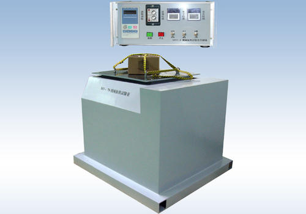
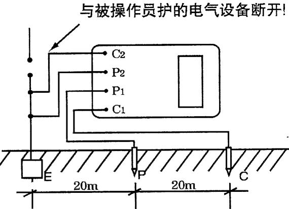
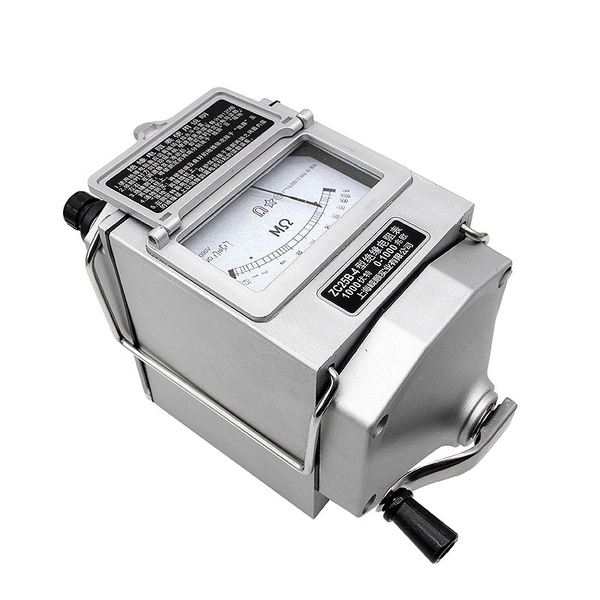
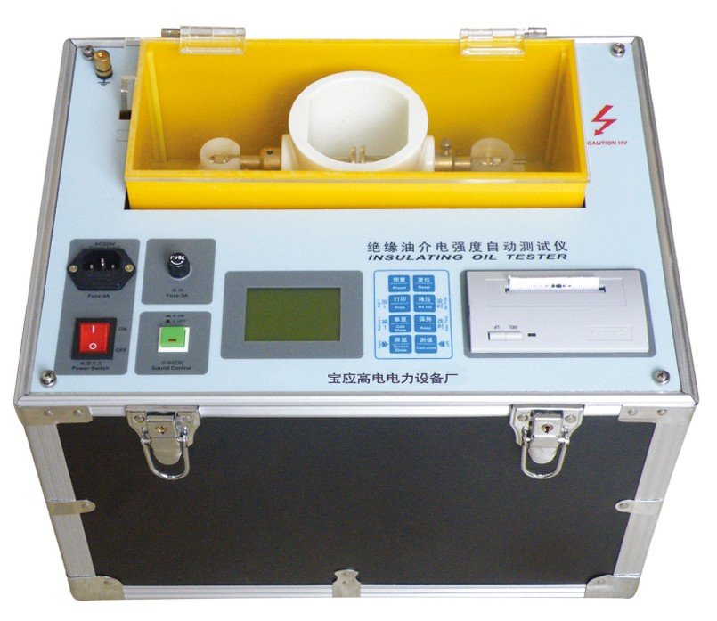
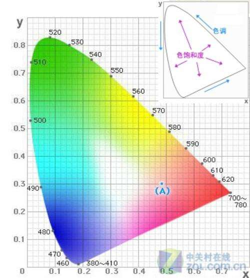

# 第一篇第五章：通用实验方法提及仪器设备的统计

## 各种耐久性

* 低温试验箱 GB10589-2008/GB10592-2008
* 高温试验箱 GB11158-2008/GB10592-2008
* 湿热试验箱 GB10586-2006
* 盐雾试验箱 GB10587
* 耐候实验箱 GB/T16422.2

## 涂层厚度

* 磁性测量仪
* 电涡流测厚仪
* 超声波测厚仪

## 力学用仪器设备

* 电子万能材料试验机

## 光学用仪器

* 逆反射测量仪 GB/T26377-2010 & JJG059-2004
* 色度测量仪

## 电工用仪器

* 万用表
* 电能质量分析仪（测量电力质量综合仪器）

## 通用设备

* 游标卡尺
* 钢卷尺
* 钢直尺
* 螺旋千分

## 交通机电设施检测

* 温度交变实验箱子 —— 可以专用箱子，也可以高温箱低温箱组合 GB11158-2008 & GB10589-2008
* 循环盐雾实验  —— 可以专用箱子，也可以普通盐雾试验箱&恒温恒湿试验箱组合
* 机械振动实验 GB/T2423.10-2008 第四章

* IP防护实验 IPXY   X代表防尘防异物 ，Y代表防水
* 接地电阻

* 绝缘电阻

* 介电强度

* 电磁兼容 GB/T 17626 （静电放电、辐射电磁场抗扰度、电快速瞬变脉冲群抗扰）

## 防腐处理技术

* 磁性测厚仪 GB/T 4956-2003
* 镀锌层附着性能测定仪-锤击试验
* 低温脆化温度试验箱

# 第三篇 仪器设备记录（下部可能记录的是大块系统组成）

# 监控设施 1-6章

## 1 车辆检测器

如：环形线圈车辆检测器、微波车辆检测器、视频车辆检测器、超声波车辆检测器等

## 2 气象检测器

公路监控系统气象检测器包括：能见度检测器、路面状况检测器、温湿度检测器、风力风向检测器、雨量检测器等

## 3 闭路电视监视系统

由视频摄像子系统、图像传输子系统、输出子系统、控制子系统组成

* 视频摄像子系统（眼睛）包括：摄像机、摄像机镜头、防护罩、云台、摄像机立柱等
* 图像传输子系统（纽带）包括：视频发射机、中继器、接收器、光缆、视频分频器等
* 输出子系统包括：监视器、硬盘录像机、延时录像机
* 控制子系统（大脑、心脏）包括：云镜控制器、控制键盘、矩阵切换器、画面分割器等

* 视频信号发生器

## 4 可变标志

显示方式有：点阵式、翻板式、字幕式、光纤式

## 5 监控中心设备安装及软件调测

包括：计算机系统、综合控制台、CCTV监视器、电视墙、大屏幕投影系统、地图版、应用软件

## 6 监控系统计算机网络

包括：网线、插座、连接头、网卡、集线器、交换机、路由器、调制解调器、服务器组成

---

# 通信设施 7-12

## 7 通信管道与光电缆线路

* 通信管道有：水泥管、塑料管、钢管、玻璃钢管道
* 光电缆线路、光纤、接头、

> 另高密度聚乙烯硅芯塑料管、双壁波纹管、公路用玻璃纤维增强塑料管道、公路用玻璃纤维增强塑料管箱 的技术要求和检测方法见第二篇第十章

## 8 光纤数字传输系统

* 基带传输 & 频带传输
* 工作原理： PDH、SDH、

## 9 数字程控交换系统

* 由交换网络、接口子系统、控制子系统3部分组成
* 硬件：话路系统、控制系统、网络交换机

## 10 紧急电话系统

* 紧急电话系统：有线式、无线式两类
* 组成：主机、路侧基础、报警分机、通信线路
* 控制中心设备：主控设备、打印机、防雷配线模块

## 11 无线移动通信系统

* 自建450MHz
* 自建800MHz
* 内容有：调度总机、中转台、车载台、手持台、天线

## 12 通信电源

系统五部分：信息监控系统、直流配电单元、交流配电单元、整流分配模块、UPS蓄电池组

----

# 收费设施 13-18

## 13 收费站入口车道设备

* 系统包括：收费车道系统、收费站管理系统、收费中心管理系统三级构成
* 设备包括：收费亭、电动栏杆、车道控制器、收费员终端、键盘、费额显示器、报警器、车道信号灯、天棚信号灯、车辆检测器、摄像机、收发打卡设备、对讲设备、自动栏杆机、车道通行灯、车道摄影机、抓拍线圈、计数线圈等

## 14 收费站出口车道设备

* 和入口车道差不多
* 多：车牌图像抓拍、储存、费额显示器、票据打印

## 15 收费站设备及软件

## 16 收费中心设备及软件

* 双绞线星型开放网络、计算机、交换机、路由器、打印机、数据备份、UPS电源

## 17 IC卡发卡编码系统

## 18 内部有线对讲及紧急报警系统

* 对讲主机、对讲分机、双向音频光端机、中间光纤传输

---

## 19 低压配电设施

* 包括：隔离电器、配电电缆、设备侧配电柜、开关电器、保护电器、接地装置、无功电容补偿、故障保护、应急电源
* 负荷等级、应急电源、柴发、不间断电源、太阳能电池、蓄电池、充放电控制器、逆变器

---

## 20 照明设施

* 照明光源、灯具、电器附件等、配电与控制设施、安全防护设备
* 亮度检测仪

---

## 21 隧道机电设施

### 隧道机电

* 中央控制系统、现场总线系统、闭路电视系统、隧道信息采集系统、火灾报警系统、交通控制系统、通风照明控制系统、通信系统、供配电系统等组成
* 以上各自有一堆，详见书623

### 环境检测设备

* 隧道环境：一氧化碳检测器、能见度检测器、风速风向检测器

### 报警与诱导设施

* 火灾手动报警器、隧道紧急电话、车道指示器、可变限速标志、可变信息标志、主动发光隧道诱导标、紧急疏散照明灯

### 通风设施

* 由轴流风机、射流风机、软件启动器组成

### 照明设施

* 照明设施、照明控制器、照明配电箱

### 消防设施

* 火灾探测器、消防控制器、火灾报警器、消火栓、灭火器、加压设施、供水设施、消防专用连接线缆、管道、配件等

### 本地控制器

* 交通监控设施、火灾报警设施、通风设施、照明设施、风速风向检测器、能见度检测器、温度检测器、有害气体浓度检测器、检测和控制单元的数据通信

### 隧道监控中心设备及软件

* 就是大办公室，控制中心的概念

----

# 提及检测内容

## 第一节概述

* 功能与作用
* 系统组成

## 第二节xx质量检验评定标准

* 基本要求
* xxx技术要求检测方法
* 外观鉴定
* xxxx防雷技术要求
* 主要项目检测方法
